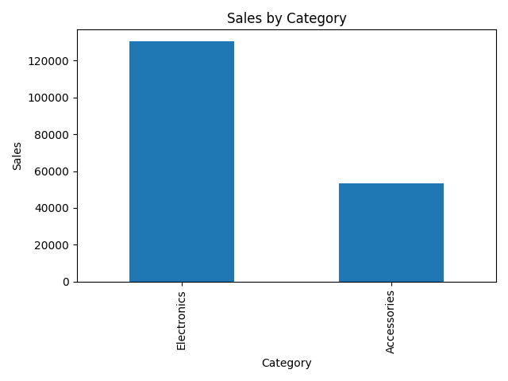
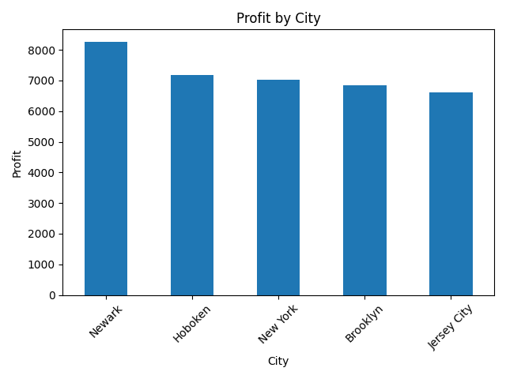
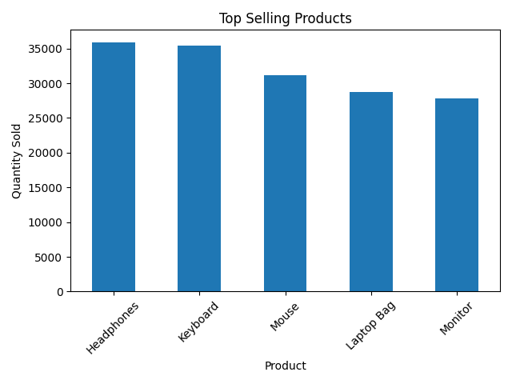

# 📊 Sales Data Analysis Project
This project analyzes sales data using Python, SQL, and Excel to uncover business insights and trends.

## 🎯 Objective
To identify key sales patterns, top-performing products, and profitability insights to support data-driven decision-making.

## 📌 Overview
This project analyzes sales data using Python, SQL, and Excel to generate business insights.

---

## 🛠️ Tools Used
- Python (Pandas, Matplotlib)
- SQL
- Microsoft Excel

---

## 📂 Project Structure
- data → raw dataset
- python → analysis code
- charts → visualizations
- Excel → processed output
- Sql → SQL queries

---

## 📊 Key Insights
- Electronics category has highest sales
- Accessories have lower sales comparatively
- Top products identified based on quantity sold
- Profit analysis done by city

---

## 📈 Visualizations

### Sales by Category

### Profit by City

### Top Products

## 🗄️ SQL Analysis

Performed analysis using SQL queries:
- Total sales by category
- Top 5 products by revenue
- Profit by city
- Sales trends

See full queries in `queries.sql`

## 🐍 Python Analysis

Used Python (Pandas, Matplotlib) for:
- Data cleaning
- Aggregation
- Visualization
- Generating business insights

---

## 📁 Output Files
- Excel file with cleaned data
- Charts saved as PNG images

---

## 🚀 How to Run
1. Open project in VS Code
2. Run `sales_analysis.py`
3. Charts will be saved in charts folder
4. Excel file will be saved in Excel folder

---

## 📌 Author
Bhagya M
